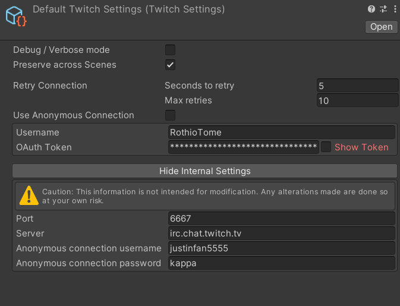
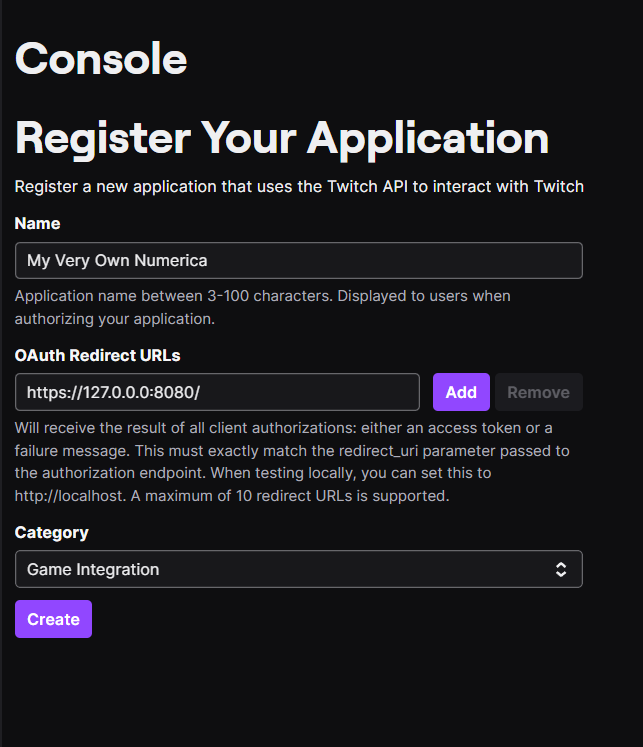
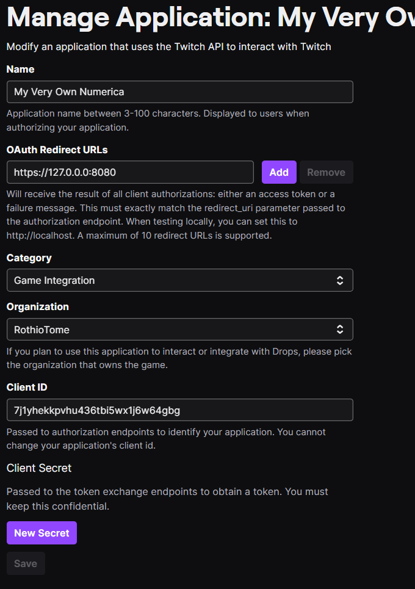

# buttonica-twitch

## Game Description
Entry for the #NumericaTwitchJam. Game based in THE BUTTON by Elendow.

## Download the game
TBD

## Featuring "Very Simple Twitch Chat" Unity Plugin
This game was entirely developed on [Twitch](https://twitch.tv/RothioTome) and uses the [Very Simple Twitch Chat Plugin](https://github.com/rothiotome/very-simple-twitch-chat)

## FAQ
### Secrets.cs can't be found
When you create a Twitch App on the [Twitch Developer Dashboard](https://dev.twitch.tv/), you get a CLIENT ID (this key is public) and you need to add it to the header in your Twitch API Calls.

Although this CLIENT ID is public, I don't think sharing mine in a repository is a good idea because every app should have its very own CLIENT ID and add it to the code in order to use the VIP/Timeout functionality.

To help you with this task, I've created a Secrets template where you can add your Client data. To add the saved file to your project, you can duplicate the file stored in ``Assets\Secrets\Secrets.cs.example`` and remove the extra extension of this file. This will result in a ``Secrets.cs`` file that will be recognized by the engine but won't be tracked by git.

To generate your own keys:

1.  Go to https://dev.twitch.tv/console/apps and authorize Twitch Developer to access your account.

2.  Click on the "Register Your Application" button.

3. Register your application. Make sure you add the localhost URL to the redirect field

4. Click on the "Manage" button.

6. Copy the generated "Client ID" and add it to your ``Secrets.cs`` file.

## Thanks
This game has been developed thanks to a loving community of people that support me every day on Twitch. This wouldn't be possible without all of you <3

## License
This project is released under the GPLv3 License by RothioTome (2023)